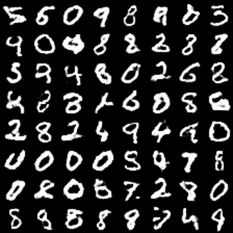

# Simple-GAN-MNIST
Pytorch implementation of a simple Generative Adversarial Network on the MNIST dataset.

# Requirements
- Python 3.8.5
- pytorch 1.6.0
- torchvision 0.7.0
- tensorboard 2.3.0
- tqdm 4.50.2

Make sure to download the MNIST dataset.

# 1) Hyperparameters
Specify hyperparameters inside a .json file, e.g.:

```json
{
    "dim_latent": 100,
    "batch_size": 16,
    "learning_rate": 0.0002,
    "beta_1": 0.5,
    "beta_2": 0.999,
    "num_epochs": 5,
    "num_fake_samples": 30
}
```

# 2) Training
Train the model:
```
python3 train_gan.py --datadir <path_to_mnist>
```
Alternatively you may want to specify 
- path to your custom set of hyperparameters ```--params```
- log directory ```--logdir```
- model directory ```--modeldir```
- model output name ```-o```
- training device ```--device``` [specify None for cpu]
- number of fake sample outputs ```num_fake_samples_eval```

# 3) Inspecting Results
Learning curves for the discriminator and generator can be inspected using
tensorboard. 

*Example fake numbers from training with the hyperparameters specifed above.*
